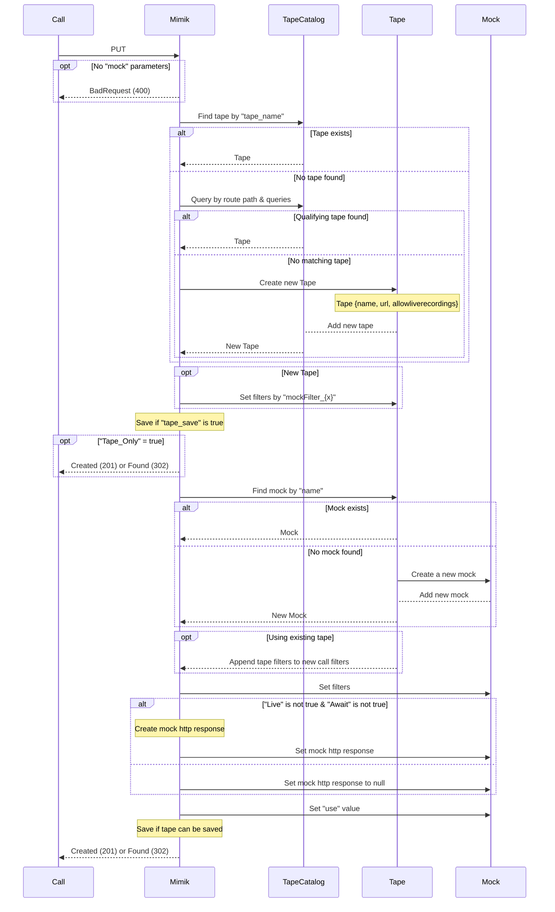
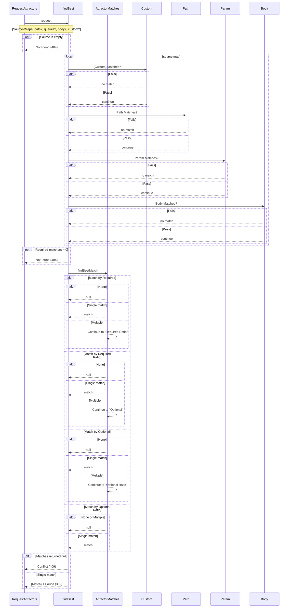

# Mock API

## PUT

## ~~PATCH~~

# General
## RequestAttractors (mockFilter_{filter})
`Ratio` is defined by "how much of the literal regex matches" 
> Example:  
> "`matchevery`" would have a higher ratio than "`match.*`" for an input of `matcheverything` 
> "matchevery" = 0.8% 
> "match.*" = 0.46%

`avoid` ratio will always equal `1` if it matches

`{...} Matches? = ...`:
- No attractors + testing data = `Fail`
- Attractor has data + testing data is empty = `Fail`
- Any Attractor's `allowAllInputs` is true = `Pass`
- All Attractor values are empty = `Pass`
  - And the attractor's `Except` is false

